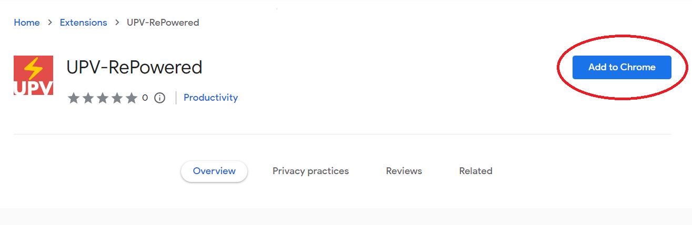
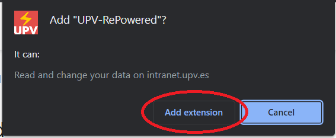
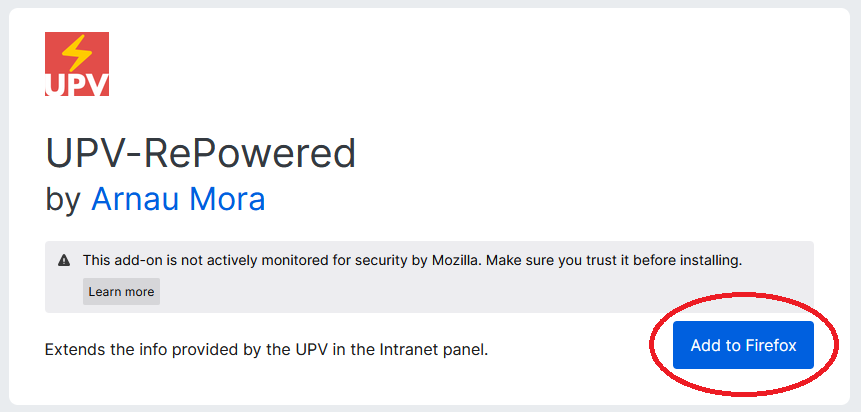
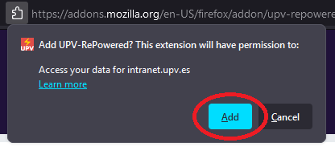
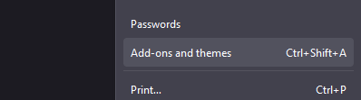
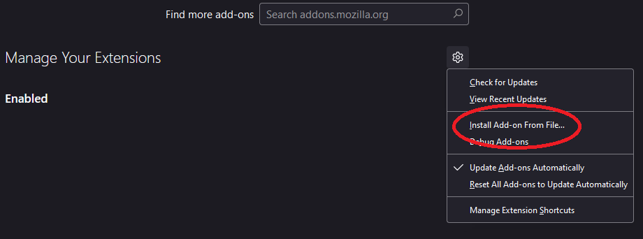

# UPV RePowered
**Chrome:**

[![Chrome Web Store][chrome-badge-version]][chrome-extension]
[![Chrome Web Store][chrome-badge-users]][chrome-extension]
[![Chrome Web Store][chrome-badge-rating]][chrome-extension]

**Firefox:**

[![Mozilla Add-on][mozilla-badge-version]][mozilla-addon]
[![Mozilla Add-on][mozilla-badge-users]][mozilla-addon]
[![Mozilla Add-on][mozilla-badge-rating]][mozilla-addon]

**Github:**

[][latest-release-page]
[][github-releases]\
[][latest-release-firefox]
[][latest-release-chrome]

[![Release Workflow status][release-badge]][release-workflow]

Extends the info provided by the UPV in the Intranet panel.

Based on: https://gist.github.com/ArnyminerZ/820e40b2584b7368f4782d91f0420595

Current functionalities:
* Provides stats on the marks of the students:
  * Number of students.
  * Number of students that went to the exam.
  * Percentage of students that went to the exam in correlation with the ones who didn't.
  * Mean of the marks of the students.
  * Percentage of students that got a mark greater or equal to 5.

Supported languages:
* 🇦🇩 Catalan (`ca`)
* 🇪🇸 Spanish (`es`)

# Installation instructions
## Extensions Store
### Chrome
1. Enter the Chrome's [Addon Store](https://chrome.google.com/webstore/category/extensions), and search for "UPV-RePowered" or press [this link][chrome-extension].

2. Press the "Add to Chrome" button\

3. Press the "Add extension" button\

4. You are ready! Just access a marks screen on [intranet.upv.es](https://intranet.upv.es/pls/soalu/sic_asi.Notes_TemaAlu_Asi?P_IDIOMA=c&p_vista=intranet).

### Firefox
1. Enter the Firefox's Addon Store, and search for "UPV-RePowered" or press [this link][mozilla-addon].

2. Press the "Add to Firefox" button\

3. Press the "Add" button on the popup window.\

4. You are ready! Just access a marks screen on [intranet.upv.es](https://intranet.upv.es/pls/soalu/sic_asi.Notes_TemaAlu_Asi?P_IDIOMA=c&p_vista=intranet).

## Manual install
### Chrome
1. Download the [latest release][latest-release-chrome].
2. Go to [chrome://extensions/](chrome://extensions/).
3. Drag and drop the downloaded zip file into this page.
4. You are ready! Just access a marks screen on [intranet.upv.es](https://intranet.upv.es/pls/soalu/sic_asi.Notes_TemaAlu_Asi?P_IDIOMA=c&p_vista=intranet).

### Firefox
1. Download the [latest release][latest-release-firefox].
2. Press <kbd>Ctrl+Shift+A</kbd> or open the dropdown menu on the top right side, and choose "Add-ons and Themes".\

3. Press the cog icon to the right of "Manage your extensions".\

4. Select the downloaded zip file.
5. You are ready! Just access a marks screen on [intranet.upv.es](https://intranet.upv.es/pls/soalu/sic_asi.Notes_TemaAlu_Asi?P_IDIOMA=c&p_vista=intranet).

# Used libraries
* [chrome-webstore-upload](https://github.com/fregante/chrome-webstore-upload)

# Notes about versions
## Firefox scheme
Firefox doesn't allow signing multiple versions with the same version number. Since we release the app both in the
asset store and in the GitHub releases, we have to use a different version number for each one.

`.0` suffix is used for the asset store, and `.1` for the GitHub releases.

# Changelog
## 1.0.3
* Added direct links for iCalendar for [UPV_iCal-ColorFix](https://github.com/ArnyminerZ/UPV_iCal-ColorFix).
## 1.0.2
* Fixed a missing `%` in the approved students row.
## 1.0.1 - Localization
Added localized messages in Catalan and Spanish.
## 1.0.0 - Initial Release
**Current functionalities**
Provides stats on the marks of the students:
* Number of students.
* Number of students that went to the exam.
* Percentage of students that went to the exam in correlation with the ones who didn't.
* Mean of the marks of the students.
* Percentage of students that got a mark greater or equal to 5.

---
[chrome-extension]: https://chrome.google.com/webstore/detail/upv-repowered/npfnhbnfidlfkkoafboojlabnjaoldip
[mozilla-addon]: https://addons.mozilla.org/ca/firefox/addon/upv-repowered/

[chrome-badge-version]: https://img.shields.io/chrome-web-store/v/npfnhbnfidlfkkoafboojlabnjaoldip?label=version&style=flat-square
[chrome-badge-users]: https://img.shields.io/chrome-web-store/users/npfnhbnfidlfkkoafboojlabnjaoldip?style=flat-square
[chrome-badge-rating]: https://img.shields.io/chrome-web-store/rating/npfnhbnfidlfkkoafboojlabnjaoldip?style=flat-square

[mozilla-badge-version]: https://img.shields.io/amo/v/upv-repowered?label=version&style=flat-square
[mozilla-badge-users]: https://img.shields.io/amo/users/upv-repowered?style=flat-square
[mozilla-badge-rating]: https://img.shields.io/amo/rating/upv-repowered?style=flat-square

[latest-release-chrome]: https://github.com/ArnyminerZ/UPV-RePowered/releases/latest/download/UPV-RePowered-Chrome.zip
[latest-release-firefox]: https://github.com/ArnyminerZ/UPV-RePowered/releases/latest/download/UPV-RePowered-Firefox.zip

[latest-release-page]: https://github.com/ArnyminerZ/UPV-RePowered/releases/latest
[github-releases]: https://github.com/ArnyminerZ/UPV-RePowered/releases

[release-badge]: https://img.shields.io/github/actions/workflow/status/ArnyminerZ/UPV-RePowered/release.yml?style=flat-square
[release-workflow]: https://github.com/ArnyminerZ/UPV-RePowered/actions/workflows/release.yml